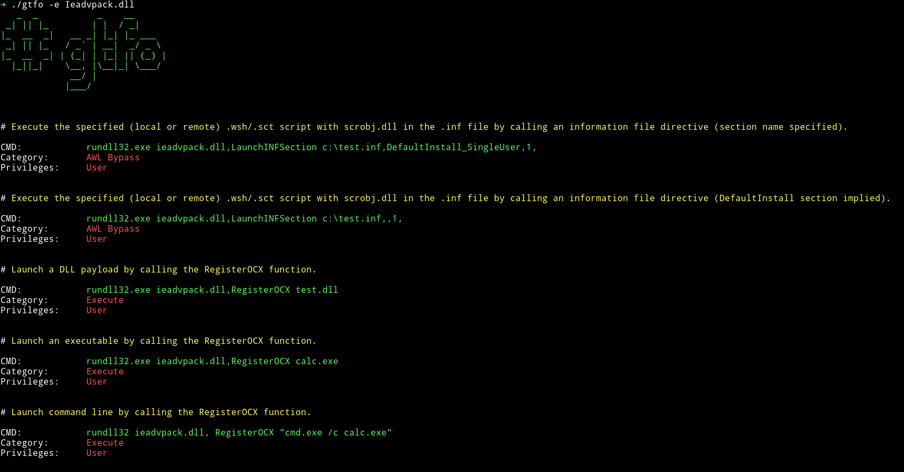
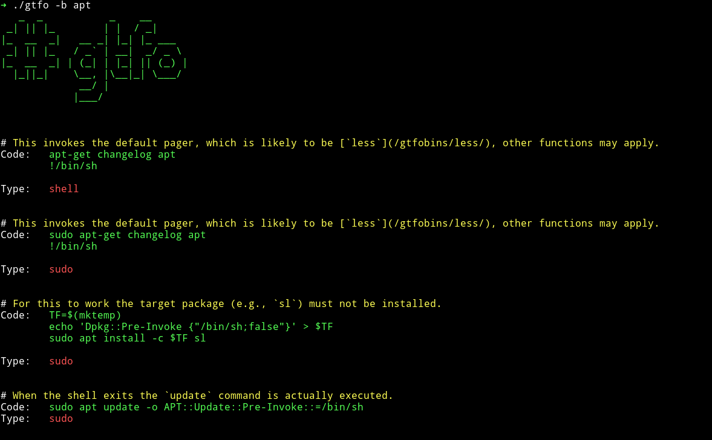
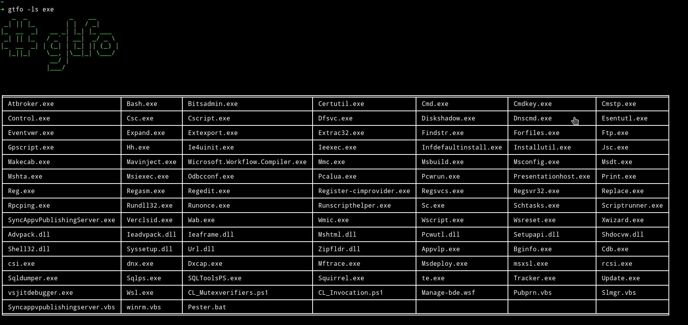
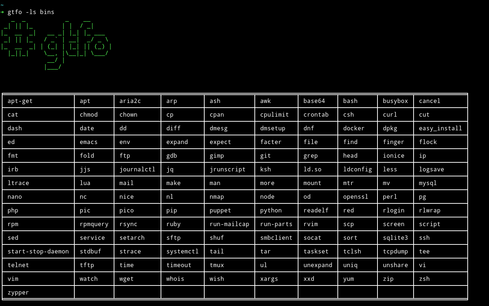
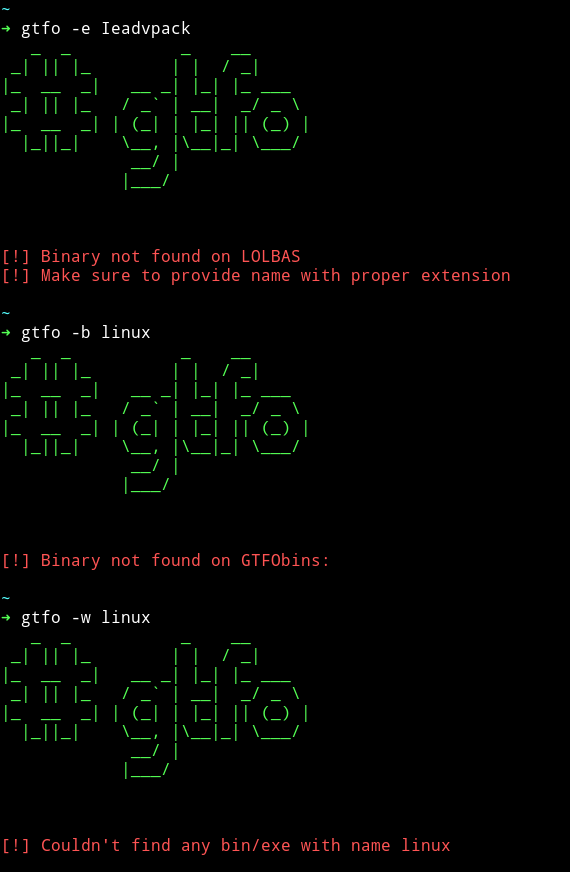

<h1 align="center">gtfo</h1>

  <a href="https://github.com/mzfr/gtfo/wiki">gtfo Wiki</a> •
  <a href="https://github.com/mzfr/gtfo/wiki/Introduction">Introduction</a> •
  <a href="https://github.com/mzfr/gtfo/wiki/Usage">Usage</a> •
  <a href="https://github.com/mzfr/gtfo/wiki/Installation">Installation</a> •
  <a href="https://github.com/mzfr/gtfo#gallery">Gallery</a>

gtfo is a tool purely written in python3 to search binaries on [GTFOBins](https://gtfobins.github.io/) and [LOLBAS](https://lolbas-project.github.io/).

### Features

The only feature of this tool is to give you the ability to search gtfobins and lolbas from terminal.

oh and it also make you stick to your terminal. You won't have to face the bright light of your browser when you find out that vim is marked as SUID on the system you just got reverse shell on but don't know how to exploit that.

### Gallery

* __Searching GTFOBins__

* __Searching lolbas__

* __List exe__

* __List binaries__

* __Errors__ :smile:

### Contribution

* Report a bug
* Fix something and open a pull request
* There are some `TODO` in the project. Help me complete those

In any case feel free to open an issue

## Credits

Thanks to [norbemi](https://twitter.com/norbemi) and [cyrus_and](https://twitter.com/cyrus_and) for creating [GTFOBins](https://gtfobins.github.io/) without that this project won't be in existence.

Also thanks to all the creators of [LOLBAS](https://lolbas-project.github.io/#)

## Say Thanks 

If you'd like to :tada: [say thanks](https://saythanks.io/to/mzfr) :smile:
